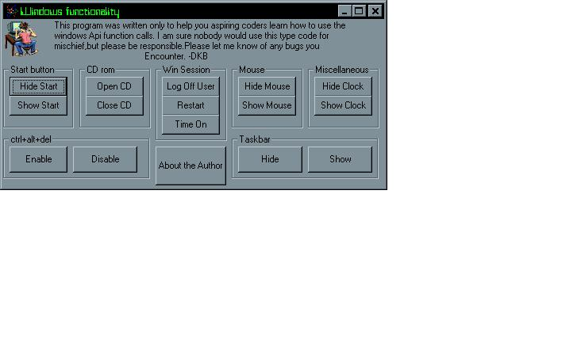



## Windows API functionality

### Description

I have seen many submissions on how to Hide/show windows functions but they werent all written very well or they were "overcoded". This code is very easy to understand and easy to incorporate into your project. I havent commented it very much but it doesnt need it really.I can comment it heavily if you'd like me too and re-send the code to you.Please E-mail me if this is the case. I also didnt consolidate the module's for the reason that its hard for a new coder to discriminate beetween neccessary declarations for there function's. I know this would helped me when I was starting out.Please vote and Enjoy-
 
### More Info
 

             |
---                |---
**Submitted On**   |2001-07-23 22:02:54
**By**             |[Shane Myers](https://github.com/Planet-Source-Code/PSCIndex/blob/master/ByAuthor/shane-myers.md)
**Level**          |Intermediate
**User Rating**    |5.0 (30 globes from 6 users)
**Compatibility**  |VB 6\.0
**Category**       |[Windows API Call/ Explanation](https://github.com/Planet-Source-Code/PSCIndex/blob/master/ByCategory/windows-api-call-explanation__1-39.md)
**World**          |[Visual Basic](https://github.com/Planet-Source-Code/PSCIndex/blob/master/ByWorld/visual-basic.md)
**Archive File**   |[Windows AP233847242001\.zip](https://github.com/Planet-Source-Code/shane-myers-windows-api-functionality__1-25408/archive/master.zip)

